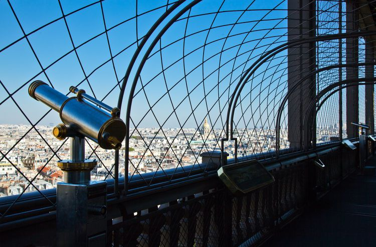

# FRANCE
<html>
  
   <head>
<body>
<h1>Interesting Facts and Secrets About the Eiffel Tower</h1>

  <h2>The Eiffel Tower — or, la Tour Eiffel — has long been one of the world's most recognizable landmarks, symbolizing the romance and ingenuity of the City of Light. </h2>

  <h2>Designed as the centerpiece of the 1889 World's Fair,the Tower was meant to commemorate the centennial  of the French Revolution and to show off France's modern
  industrial prowess on a world stage. </h2>

  <h2>The tower's construction, finished after two years, two months, and five days, was considered a marvel of precision and speed.
  Gustave Eiffel's civil engineering firm used 7,300 tons of iron and 2.5 million rivets, and the result stood triumphant over the Champs de Mars, receiving more than two million
  visitors during the fair. </h2>

  <h2>The Tower’s now-famous silhouette has been emulated around the world in places like Las Vegas, Prague, Tianducheng, China, and, of course, Paris, Texas. The design wasn’t without its detractors, however — a "Protest against the Tower of Monsieur Eiffel,” signed by the likes of Guy de Maupassant, Alexandre Dumas fils, and other well-known artists, was published in the newspaper Le Temps before the project’s completion. The letter argued that the tower would be “a gigantic black factory chimney, its barbarous mass overwhelming and humiliating all our monuments and belittling our works of architecture, which will just disappear before this stupefying folly.”</h2>

  <h2>In defiance of such protests, the Eiffel Tower did see the light of day and has stood the test of time. It remains one of the most visited monuments in the world, welcoming almost seven million visitors a year and more than 300 million people since its debut. It has changed over the years, with the addition of lighting, fresh coats of paint, and numerous installations that have come and gone. </h2>

<h2>And there’s still more to this landmark than meets the eye. Despite the incredible number of people who have visited since it opened, La Dame de Fer still has a few secrets to share.  </h2>

<a> href="https://www.travelandleisure.com/travel-news/eiffel-tower-just-got-taller"</a>

<h1>There’s a penthouse apartment at the top.</h1>

<h2>Gustave Eiffel reserved the uppermost level of the tower for himself, where he hosted famous guests like Thomas Edison in a private apartment that he designed. The space has since been transformed into a recreation of Eiffel's office, complete with wax figures of himself, his daughter, and Edison, and it's open for the public to tour.</h2>

<h1>Gustave Eiffel didn’t design the tower.</h1>

<h2>While the tower is named for Eiffel, it was actually Maurice Koechlin and Emile Nouguier — two engineers who worked for his company — who designed the structure. They also commissioned French architect Stephen Sauvestre to work on the appearance of the project in order to quell public concerns about the harsh, utilitarian nature of the original design. They ultimately beat out more than 100 other projects in a contest to choose the main attraction of the World's Fair.  </h2>

<h1>The Eiffel Tower was supposed to be torn down after 20 years.</h1>
<h2>The tower was built with the intent of showing off France's industrial prowess during the World's Fair, but the plan was to tear it down after 20 years. However, Eiffel cleverly put a radio antenna and wireless telegraph transmitter in the tower. After proving radio’s usefulness to the government in 1910, Eiffel was granted a 70-year extension to his lease. By 1980, of course, the tower had become an indelible symbol of both Paris and France, and it was in no danger of demolition.</h2>

<h1>The Eiffel Tower was almost destroyed during World War II.</h1>
<h2>In August 1944, as the Nazis were losing control of occupied Paris, Adolf Hitler commanded his generals to level the city. Plans were drawn up to mine the Eiffel Tower with explosives. Thankfully, Allied troops swooped in before the order could be carried out. Subsequent air raids over Paris caused significant damage, but the Eiffel Tower survived the war intact.</h2>

<h1>The Eiffel Tower is a cousin of sorts to the Statue of Liberty.</h1>
<h2>As sculptor Frédéric-Auguste Bartholdi was designing “Liberty Enlightening the World”, he called upon his mentor, Eugène Viollet-le-Duc, to design the statue’s internal framework. After Viollet-le-Duc died in 1879, Bartholdi turned to Eiffel and Koechlin. They proved their iron expertise with Lady Liberty before moving on to the Iron Lady.</h2>

<h1>The Eiffel Tower has been home to both a post office and a theater. </h1>
<h2>The tower has been home to several businesses throughout the years, many of which are now gone. These include the newspaper “Le Figaro”, which had an office on the second floor for six months during the 1889 World's Fair, a post office tucked into the first floor, and a wooden theater on the first floor designed by Sauvestre. </h2>

               
               
              
</body>

